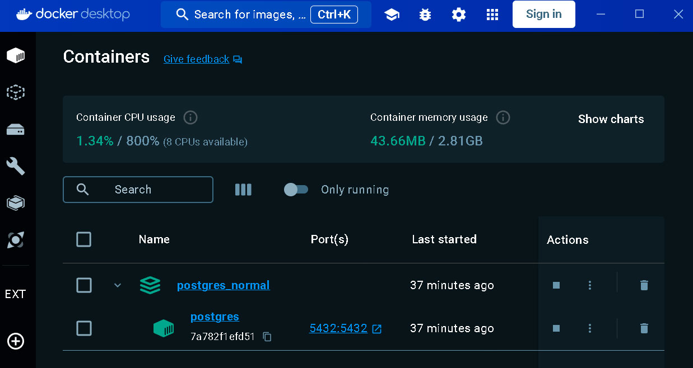
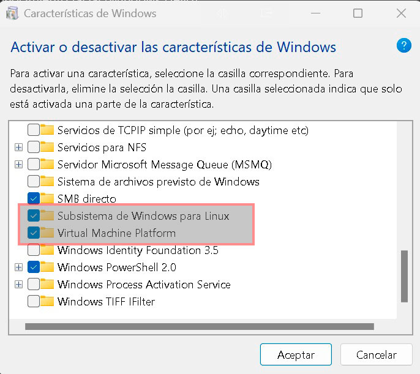
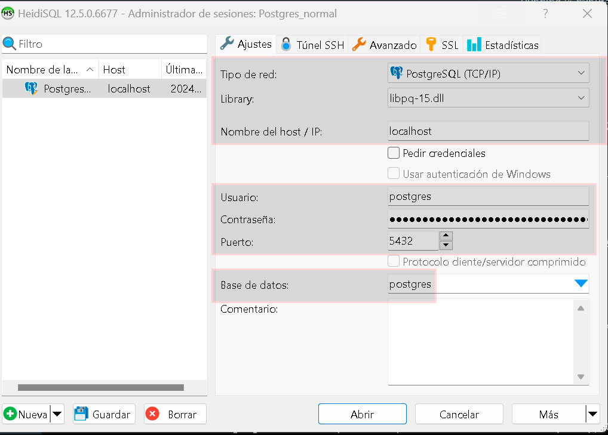

# Configuración de Docker Compose para PostgreSQL

Este archivo Docker Compose facilita la configuración de un entorno de desarrollo de PostgreSQL en tu máquina local. Puedes utilizarlo para desplegar una instancia de PostgreSQL y gestionar tus bases de datos de manera eficiente.


## Índice

* [Requisitos previos](#requisitos-previos)
* [Instrucciones de uso](#instrucciones-de-uso)
* [Notas](#notas)
* [Personalización](#personalización)

## Requisitos previos

Antes de utilizar este Docker Compose, asegúrate de tener instalado lo siguiente en tu sistema:

* Linux:

   - [Docker](https://www.docker.com/get-started)
   - [Docker Compose](https://docs.docker.com/compose/install/)

* Windows:

   - [Docker Desktop](https://www.docker.com/products/docker-desktop/)

## Instrucciones de uso

### 1. Clona este repositorio en tu máquina local si aún no lo has hecho.

```
git clone https://github.com/Leonardo-villagran/postgres_normal
```
---
### 2. Crea un archivo `.env` en la misma ubicación que el archivo `docker-compose.yml` con la siguiente configuración:

   ```plaintext
   POSTGRES_USER=postgres
   POSTGRES_PASSWORD=postgres
   POSTGRES_DB=postgres
   POSTGRES_PORT=5432
   ```

   - Asegúrate de configurar los valores según tus necesidades. Si estás en modo desarrollo no es necesario cambiar nada, pero si estás en modo producción cambia los valores para tu seguridad.
---
### 3. Asegúrate de que Docker esté en funcionamiento en tu sistema.

   * Importante:

      - Recuerda que para ejecutar Docker en tu sistema, la virtualización de la CPU debe estar habilitada en la BIOS.
      - Para usuarios de Windows, asegúrate de habilitar la Plataforma de Máquina Virtual y el Subsistema de Windows para Linux.
      
---
### 4. Abre una terminal y navega hasta la ubicación del archivo `docker-compose.yml`.
---
### 5. Ejecuta el siguiente comando para crear y ejecutar el contenedor de PostgreSQL:

   ```bash
   docker-compose up --build -d
   ```

   - El flag `-d` significa "en segundo plano". Esto lanzará el contenedor de PostgreSQL en segundo plano.
---
### 6. Una vez que el contenedor se haya iniciado correctamente, puedes conectarte a la instancia de PostgreSQL utilizando la configuración que has proporcionado en el archivo `.env`.

   * Opciones de administración:
      - Puedes optar por utilizar una herramienta de administración de bases de datos como [pgAdmin](https://www.pgadmin.org/) o conectarte directamente desde una aplicación compatible con PostgreSQL. Dentro del archivo docker-compose, encontrarás la configuración para iniciar un contenedor de PgAdmin, aunque se encuentra comentada por defecto. Si deseas utilizarlo, simplemente descomenta la sección correspondiente y sigue los mismos pasos. Podrás acceder a PgAdmin a través de la ruta `http://localhost:8082`.

      - Personalmente prefiero usar otros sistemas de gestión de bases de datos como:

         - [HeidiSQL](https://www.heidisql.com/) 
         - [DBaver](https://dbeaver.io/)

      A continuación, te proporciono un ejemplo de cómo conectar a la base de datos desde HeidiSQL:

      
---


## Notas

- El archivo `docker-compose.yml` define un servicio llamado `postgres` que utiliza la imagen oficial de PostgreSQL. Asegúrate de que la versión de la imagen coincida con tus requisitos.

- Se ha configurado un volumen para persistir los datos de PostgreSQL en `./postgres_data` y un volumen adicional para respaldos en `./pg_backup`. Puedes modificar estas ubicaciones según tus necesidades.

- El archivo `.env` se utiliza para almacenar variables de entorno que se pasan al contenedor de PostgreSQL. Asegúrate de configurar las variables de entorno según tus requisitos.

- Puedes cambiar el puerto externo (variable `POSTGRES_PORT`) en el archivo `.env` si es necesario.


## Personalización:

Este README proporciona solo las instrucciones básicas para configurar y utilizar el entorno de desarrollo de PostgreSQL. Siéntete libre de personalizarlo y documentarlo aún más según tus necesidades específicas. Agrega información adicional sobre la estructura de tu base de datos, instrucciones de migración, o cualquier otro detalle relevante para tu proyecto.